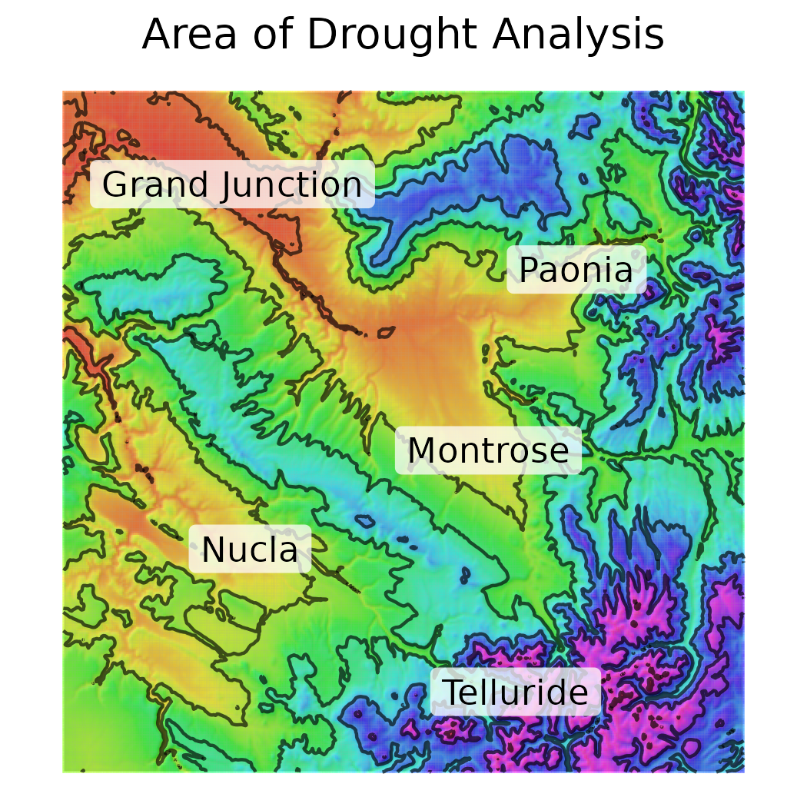
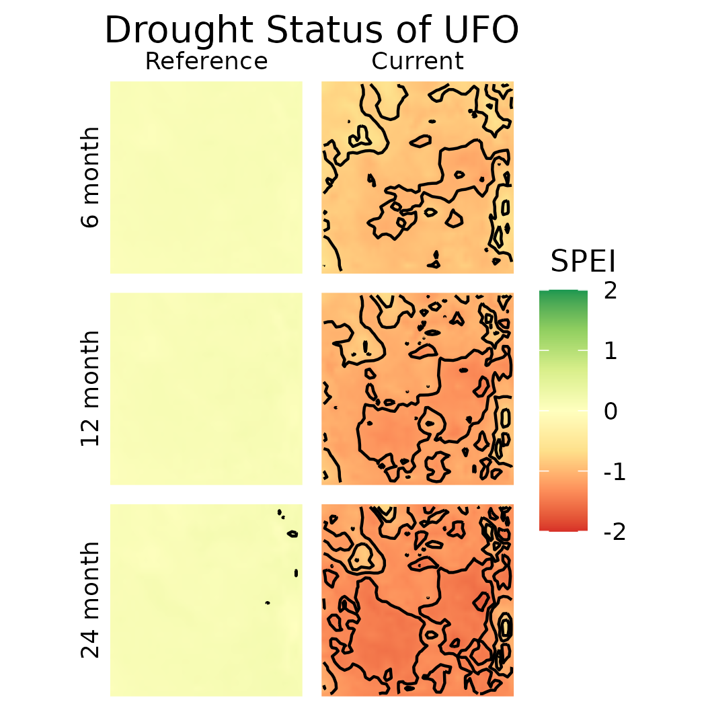

## Background 
The AIM sample design is split into five panels, one for each year, with the intention that temporal analyses can be conducted across the panels (*see X.X for more info*). Ideally, these panels will reflect consistent natural climatic variation. In others words, some years will be drier while other years will be wetter, and the differences they have on the attributes measured by AIM can be considered. However, we felt, and our constant monitoring of the University of Nebraska-Lincolns Drought Monitor over this period, supported the notion that we sampled during a period of immense drought. In fact, the sampling was concluded during a period of drought shown to be the most severe across Western North America since the year 800 A.D. (@williams2022rapid). Here we contextualize our sampling period within the known climatic variation in the field office, and discuss why we dismiss calculating AIM metrics separately for each year. 

Contrary to the concept of Agricultural drought, the exploration and understanding of Ecological drought is nascent and not as well defined (@crausbay2017defining, @slette2019ecologists). In fact, numerous recent papers published in *peer-reviewed journals* have sought to both define this term, and formulate it in a way which it may be applied to the management of natural resources. A recent example of the term is:

> "_**ecological drought** ... an episodic deficit in water availability that drives ecosystems beyond thresholds of vulnerability, impacts ecosystem services, and triggers feedbacks in natural and/or human systems_" 
>
> `r tufte::quote_footer('--- Crausbay et al. 2017')`

Guidance regarding how to move from defining the term 'ecological drought' to using it this term is also recent, and limited.

> "_We suggest that future drought publications provide at least one of the following: 
**(a)** the climatic context of the drought period based on long‐term records; **(b)** standardized climatic index values; **(c)** published metrics from drought‐monitoring organizations; **(d)** a quantitative definition of what the authors consider to be drought conditions for their system_"
>  
> `r tufte::quote_footer('--- Slette et al. 2019')`

In this section of the report, we perform both operations **a, b**, and calculate our own drought metrics using the exact same equations, and software implementations used to calculate **c** as these organizations. We opt to calculate **c** ourselves due to the topographic complexity (rugged mountains) of the study area making the coarse scale models generated by other organizations of limited utility in understanding the Uncompahgre Field Office. Finally, for the purposes of this document we do define **d** for our field office, using the expertise of several Natural Resource Specialists in Western Colorado. Hence, in this section we meet not only the suggestion to meet one of the metrics above, but all of them. 

```{r setup, include=FALSE}
knitr::opts_chunk$set(echo = F)
knitr::opts_chunk$set(dpi = 300) 
knitr::opts_chunk$set(message = F)
knitr::opts_chunk$set(warning = F)

```

```{r load libraries, warning=F, message = F}
library(tidyverse)
library(terra)
source('functions.R')
```

## Methods: 

Calculations of metrics which measure drought essentially reflect the relationship of 1) the amount of moisture entering an area, 2) and the amount of moisture leaving that area, and how 3) these values are balanced. When more moisture enters an area than leaves it, the moisture balance will be positive, when the moisture balance is negative for an extended period of time the area will in drought. Hence all equations for measuring drought may be conceptually simplified to
$$1_{MoistureIn} - 2_{MoistureOut} = 3_{Balance}$$ 

When $1_{MoistureIn} < 2_{MoistureOut}$ than $-3_{Balance}$ is negative and drier conditions prevail.  In calculating drought the amount of moisture entering an area (1), is simply equivalent to the volume or precipitation, in any form (e.g. rain or snow). The amount of moisture leaving the area (2) via the process of evaporation is driven by many processes, such as the amount and intensity of sunshine, wind, temperature. The amounts of potential evaporation (the evaporation which would occur is sufficient amounts of water were present to allow) is commonly modelled using one of three models, which since their original developments have been slightly modified in numerous ways (@xiang2020similarity). In order of increasing complexity these are the Thornwaite, Hargreaves, and the Penman-Montieth equations (@thornthwaite1948approach @penman1948natural, @hargreaves1985irrigation). We chose to utilize the Penman-Montieth equation to estimate the Potential Evaporation in our study area, because both the Thornwaite and Hargreaves equations have been shown to under-estimate drought conditions in arid regions (@begueria2014standardized). 

The most common and widely employed metric of measuring drought is the Palmer Drought Severity Index (PDSI). This metric is used by the USDA, and is highly effective for conveying information regarding drought in agricultural settings (@palmer1965meteorological). However, a metric preferred for calculating general drought outside of irrigated agricultural areas is the Standardized Precipitation Index (SPI) (@mckee1993relationship, @hayes2011lincoln). One drawback of the SPI is that it does not account well for long linear trends, namely climate change. Using SPI would underestimate the values of drought in the study area, as drought is contingent upon air temperature and it's effect upon evaporation. To overcome this shortcoming the Standardized Precipitation Evapotranspiration Index (SPEI) was developed (@vicente2010multiscalar, @begueria2014standardized). We will employ the SPEI for visualizing drought.


```{r Create template raster for sun hours, eval = F}

template <- rast('/hdd/Geospatial_data/sunhours/input/UFO_dem_10_smooth.tif')
xy <- ext(template)

coarse_template <- rast(nrow = 100, ncol = 100, crs = crs(template),
     xmin = xy[1], xmax =	 xy[2], ymin 	=  xy[3], ymax =  xy[4], vals = 0
       )
writeRaster(coarse_template, '/hdd/Geospatial_data/sunhours/input/coarse.tif')

rm(template, xy, coarse_template)
```

```{bash calculate sun hours in GRASS GIS, eval = F}
grass --tmp-location /hdd/Geospatial_data/sunhours/input/coarse.tif
pOUT='/hdd/Geospatial_data/sunhours/output'

for i in {1..365}
do
  rasterfari=SunHours$i
  r.sunhours sunhour=$rasterfari year=2000 day=$i --overwrite
  r.out.gdal input=$rasterfari output=$pOUT/${rasterfari} format=GTiff -c --overwrite
done

r.in.gdal input=/hdd/Geospatial_data/sunhours/input/coarse.tif output=coarseDEM

for i in {1..365}
do
  rasterfari=BeamRad$i
  r.sun beam_rad=$rasterfari day=$i --overwrite nprocs=16 elevation=coarseDEM linke_value=2.325
  r.out.gdal input=$rasterfari output=$pOUT/${rasterfari} format=GTiff -c --overwrite
done

exit

```

Metrics of sunshine were calculated using r.sun (total beam irradiance) and r.sunhours (daily sunhours) in Grass GIS (@GRASS_GIS_software), on Linux Ubuntu 20.04.5 LTS. The function r.sunhours requires a year for which to calculate these values for, the year 2000 was selected as it represents a rounded midpoint of the temporal range of the climate variables (1979-2021), the linke value for r.sun was set at 2.35 (in lieu of the default value of 3.0), which is the mean of the annual linke value for mountains (2.75), and rural areas (1.9). Subsequent to these calculations, which were performed for each day of the year, the values were recalculated as monthly means. Subsequent to the calculations the total sun hours were subtracted from the mean monthly percent cloud cover dataset. 

```{r Process Sun Hour Data into Monthly Means, eval =F}

sh_p <- '/hdd/Geospatial_data/sunhours/output'

files <- data.frame(filename = list.files(sh_p, pattern = 'SunHours')) %>% 
  mutate(number = as.numeric(str_extract_all(filename,"\\(?[0-9,.]+\\)?")),
         fpath = file.path(sh_p, filename)) %>% 
  arrange(number) %>% 
  bind_cols(., 'Month' =  dmonths_normal)

mean_rasters <- files %>% 
  split(., .$Month) %>% 
  lapply(., '[[', c('fpath')) %>% 
  map(., rast) %>% 
  map(., mean)
mean_rasters <- rast(mean_rasters)

writeRaster(mean_rasters, '../data/raw/MeanSunHours.tif', overwrite = T)
file.remove(files$fpath)

# repeat the process for solar radiation. 
files <- data.frame(filename = list.files(sh_p, pattern = 'BeamRad')) %>% 
  mutate(number = as.numeric(str_extract_all(filename,"\\(?[0-9,.]+\\)?")),
         fpath = file.path(sh_p, filename)) %>% 
  arrange(number) %>% 
  bind_cols(., 'Month' =  dmonths_normal)

mean_rasters <- files %>% 
  split(., .$Month) %>% 
  lapply(., '[[', c('fpath')) %>% 
  map(., rast) %>% 
  map(., mean)
mean_rasters <- rast(mean_rasters)
mean_rasters <- mean_rasters * 0.0036 # conversion to MegaJoules, you can 
# compare your values to a kilowatt / hour map to see if you are in the range
# before you do this just do mean( mean_raster/1000 ) and is is really
# quick to find an annual map, I recommend doing it to make sure your calcs worked
# out A-OK - this stuff is way outside my wheelhouse. Ours are spot on. 

writeRaster(mean_rasters, '../data/raw/MeanRadiation.tif', overwrite = T)
file.remove(files$fpath)

rm(pancake, dmonths, sh_p, files, mean_rasters)
```

```{r Download climate vars from gridmet and subset, eval = F}

p <- '/media/reed/ExternalHD/drought_geospatial/Gridmet'
Get_Gridmet(product_type = "pr", start_year = 1979, end_year = 2021, destination = p)
Get_Gridmet(product_type = "tmmx", start_year = 1979, end_year = 2021, destination = p)
Get_Gridmet(product_type = "tmmn", start_year = 1979, end_year = 2021, destination = p)
Get_Gridmet(product_type = "vs", start_year = 1979, end_year = 2021, destination = p)
Get_Gridmet(product_type = "rmax", start_year = 1979, end_year = 2021, destination = p)
Get_Gridmet(product_type = "rmin", start_year = 1979, end_year = 2021, destination = p)
p <- file.path(p, 'Gridmet')

```


All climate variables, aside from cloud cover, were downloaded from gridMet using 'Get_Gridmet' (@abatzoglou2013development, Lovell & Benkendorf 2022). These variables were chosen in lieu of one of the two datasets from which they are derived, PRISM, due to that dataset lacking Wind Speed and Relative Humidity data (@abatzoglou2013development). As gridMET data are at a daily resolution, the means for each month of each year from 1979 to 2021 were calculated using R. The temperature values were converted to Celsius from Kelvin $x - 273.5$. 

```{r reduce gridmet climate vars to monthly means, eval = F}
# now reduce the size of these data by making the monthly means
root_p <- '/media/reed/ExternalHD/drought_geospatial/Gridmet'
out_p <- '/media/reed/ExternalHD/drought_geospatial/monthly_gridmet'
crop_p <- '../data/raw/UFO_slope_deg.tif'

gridSTATS(inpath = root_p , FUN = mean,  outpath = out_p, cropRast = crop_p, variable = 'vs')
gridSTATSsum(inpath = root_p , outpath = out_p, cropRast = crop_p, variable = 'pr')
gridSTATS(inpath = root_p , FUN = mean,  outpath = out_p, cropRast = crop_p, variable = 'tmmn')
gridSTATS(inpath = root_p , FUN = mean,  outpath = out_p, cropRast = crop_p, variable = 'tmmx')
gridSTATS(inpath = root_p , FUN = mean,  outpath = out_p, cropRast = crop_p, variable = 'rmax')
gridSTATS(inpath = root_p , FUN = mean,  outpath = out_p, cropRast = crop_p, variable = 'rmin')

rmax <- rast(file.path(out_p, 'rmin', (list.files(file.path(out_p, 'rmin')))))
rmin <- rast(file.path(out_p, 'rmax', (list.files(file.path(out_p, 'rmax')))))
rhmean <- mean(rmax, rmin)
rhmean <- split(rhmean, leapYearLookUp$Year)
names(rhmean) <- unique(leapYearLookUp$Year)

ifelse(!dir.exists(file.path(out_p, 'rhmean')), 
         dir.create(file.path(out_p, 'rhmean')), FALSE)
fnames <- file.path(out_p, 'rhmean', paste0('rhmean', '_', names(rhmean), '.tif'))
mapply(writeRaster, rhmean, fnames, overwrite =T)

rm(root_p, out_p, crop_p, gridSTATS)
```

```{r Border, eval= F}
border <- ext(rast('../data/raw/UFO_slope_deg.tif'))
```

Cloud Cover data were downloaded from EarthENV, from the study of Wilson (2016), and were transformed back into percentages by multiplying $x * 0.01$, raster data are often transmitted with alterations of decimal points to reduce the file size. 

```{r Crop Cloud data, eval = F}

cpath <- '/media/reed/ExternalHD/drought_geospatial/cloud'
cfiles <- file.path(cpath, list.files(cpath, pattern = "tif$"))
clouds <- rast(cfiles)

border <- project(rast('../data/raw/UFO_slope_deg.tif'), crs(clouds))
clouds <- crop(clouds, border)
template <- rast('/media/reed/ExternalHD/drought_geospatial/monthly_gridmet/vs/vs_1979.tif')[[1]]
clouds <- aggregate(clouds, fact =4)
clouds <- resample(clouds, template, method  = 'cubic')
names(clouds) <- unique(dmonths_normal)

# 0.01 the clouds values range from 0-10,000, and need be multiplied by 0.01 to recover % cover
clouds <- clouds * 0.01
plot(clouds)

writeRaster(clouds, '../data/raw/clouds.tif', NAflag=NA, overwrite = T)
rm(cpath, clouds, border, cfiles)
```


```{r subtract clouds from sun hours, eval = F}
SunHours <- rast('/media/reed/ExternalHD/UFO_drought/data/raw/MeanSunHours.tif')
SunHours <- resample(SunHours, template, method  = 'cubic')
SunHours <- SunHours[[unique(dmonths_normal)]]
SunHours <- project(SunHours, crs(template))

cloud_rasters <- 1 - (rast('../data/raw/clouds.tif') * 0.01 )  # to get a leading zero for a proportion
SunHours <- SunHours * cloud_rasters

writeRaster(SunHours, '../data/raw/MeanSunHours.tif',
            overwrite = T)
rm(SunHours)
```

```{r Process and match extent for total solar radiation, eval = F}
solar_radiation <- rast('../data/raw/MeanRadiation.tif')
solar_radiation <- resample(solar_radiation, template, method  = 'cubic')
solar_radiation <- solar_radiation[[unique(dmonths_normal)]]
solar_radiation <- project(solar_radiation, crs(template))

writeRaster(solar_radiation, '../data/raw/MeanSolarRadiation.tif',
            overwrite = T)
rm(solar_radiation)
```

The digital elevation model (DEM), which was utilized in the calculation of sunshine metrics and in the Penman equation, was downloaded from EarthENV, and re-sampled from it's 90m resolution to align with the grain of the other datasets - 4km (@robinson2014earthenv).

```{r Crop DEM, eval = F}

dpath <- '/media/reed/ExternalHD/drought_geospatial/dem'
dem <- rast(file.path(dpath, list.files(dpath, pattern = "bil$", recursive = T)))

border <- project(rast('../data/raw/UFO_slope_deg.tif'), crs(dem))
dem <- crop(dem, border)

template <- rast('/media/reed/ExternalHD/drought_geospatial/monthly_gridmet/vs/vs_1979.tif')[[1]]
dem <- resample(dem, template, method  = 'cubic')
dem <- exactextractr::exact_resample(dem, template, "mean")

writeRaster(dem, '../data/raw/dem.tif', overwrite = T)
rm(dpath, dem, template)
```

\newpage

__Variables to calculate Potential Evaporation via the Penman-Montieth equation__


|            Variable            |           Source            |
|  :------------------------:    |     :---------------:       |
|    precipitation sum (mm)      |       GridMET  (pr)         |
|      mean max temp (ºC)        |       GridMET (tmmx)        |
|      mean min temp (ºC)        |       GridMET (tmmn)        |
|      mean rel. humidity        | $(RH_{max} + RH_{min}) /2$  |
|    mean wind speed (km h-1)    |       GridMET (vs)          |        
|     mean sun hours (hours)     |     r.sunhours (sunhour)    |
|  mean solar radiation (MJ-m-d) |       r.sun (beam_rad)      |
|   mean cloud cover (percent)   |     Wilson, EarthEnv        |
|     elevation in meters        |       EarthEnv 90m          |

Note all of these values are over a month 

```{r SPEI vars}
myscales <- c(6,12,24)
syear <- 1979
eyear <- 2021
focal_window <- 9
```

```{r Calculate SPEI, eval = F}
out_p <- '/media/reed/ExternalHD/drought_geospatial/monthly_gridmet'
template <- rast('/media/reed/ExternalHD/drought_geospatial/monthly_gridmet/vs/vs_1979.tif')[[1]]

cloudCover <- rast('../data/raw/clouds.tif')
sunHours <- rast('../data/raw/MeanSunHours.tif')
dem <- rast('../data/raw/dem.tif')
solarRadiation <- rast('../data/raw/MeanSolarRadiation.tif')

vs <- rast(file.path(out_p, 'vs', (list.files(file.path(out_p, 'vs')))))
tmax <- rast(file.path(out_p, 'tmmx', (list.files(file.path(out_p, 'tmmx')))))
tmin <- rast(file.path(out_p, 'tmmn', (list.files(file.path(out_p, 'tmmn')))))
pr <- rast(file.path(out_p, 'pr', (list.files(file.path(out_p, 'pr'))))) # rhmean.tif
rh <- rast(file.path(out_p, 'rhmean', (list.files(file.path(out_p, 'rhmean')))))

names(vs) <- namer(vs, start = syear, end = eyear)
names(tmax) <- namer(tmax, start = syear)
names(tmin) <- namer(tmin, start = syear)
names(pr) <- namer(pr, start = syear)
names(rh) <- namer(rh, start = syear)
names(dem) <- 'elevation'
variables <- c(vs, tmax, tmin, rh, pr, dem)

names(cloudCover) <- paste0('cloudcover_', unique(dmonths_normal))
names(sunHours) <- paste0('sunhours_', names(sunHours))
names(solarRadiation) <- paste0('radiation_', names(solarRadiation))
suncloud <- c(cloudCover, sunHours, solarRadiation)

cloudvals <- as.data.frame(suncloud) %>% 
  rownames_to_column('CellID') %>% 
  pivot_longer(!CellID, names_to = 'combo', values_to = 'value') %>% 
  separate(combo, c('variable', 'month')) %>% 
  pivot_wider(names_from = variable, values_from = value)
drought_vars <- as.data.frame(variables, xy = T) %>% 
  rownames_to_column('CellID') %>% 
  pivot_longer(4:(ncol(.)-1)) %>% 
  separate(name, c('variable', 'month', 'year')) %>% 
  pivot_wider( names_from = variable, values_from = value) %>% 
  left_join(., cloudvals) %>% 
  mutate(across(.cols = tmax:tmin, ~.x - 273.5 ))

rm(cloudvals, suncloud, vs, tmax, tmin, variables, dem, pr, sunHours, rh, 
   solarRadiation, cloud_rasters)

# drought_vars <- drought_vars[complete.cases(drought_vars),]
out <- drought_vars %>% 
  rowwise() %>% 
  split(., .$CellID) %>% 
  map(~ PeTbyCell(x = .x)) %>% 
  bind_rows() %>% 
  arrange(CellID, year) %>% 
  split(., .$CellID) %>% 
  map(~ SPEIbyCell(x = .x, start_yr = syear, id_var = 'CellID', scales = myscales)) %>% 
  bind_rows()

# now we will split these out so that each year x calculation duration has a stack. 
resin <- out %>% 
  pivot_longer(cols = starts_with('months'), names_to = 'period', values_to = 'SPEI') %>% 
  split(., .[,c('period','Year', 'Month')]) %>% 
  map(~ rast(template, vals = .x$SPEI))

vars <- c('months_6', 'months_12', 'months_24')
times <- leapYearLookUp %>% 
  mutate(time = paste0(Year, '.', MONTH)) %>% 
  pull(time)
vars2 <- paste0(rep(vars, each =  length(times)), '.', times)
names(resin) <- vars2
splits <- data.frame(raw = vars2) %>% 
  separate(raw, into = c('period', 'year', 'month'), sep = '[.]')

resin <- resin[vars2]
resin <- split(resin, splits$period)
resin <- lapply(resin, rast)

resin <- lapply(resin, focal, w = focal_window, na.policy="only",  na.rm=TRUE, fun = mean)

outpath <- '../data/processed'
variable <- 'SPEI'
ifelse(!dir.exists(file.path(outpath)), 
       dir.create(file.path(outpath)), FALSE)
ifelse(!dir.exists(file.path(outpath, variable)), 
       dir.create(file.path(outpath, variable)), FALSE)
fnames <- file.path(outpath, variable, paste0(variable, '_', names(resin), '.tif'))
mapply(writeRaster, resin, fnames, overwrite = T)

rm(tmax, tmin, vs, variables, cloudCover, cloudvals, dem, sunHours, suncloud, 
   SunHours, pr, out_p, outpath, variable, resin , splits, vars2, vars, out, 
   fnames, times, drought_vars)
```

SPEI was calculated for all `r toString(eyear-syear)` years between `r toString(syear)`-`r toString(eyear)`. Cells in rasters which contained missing (NA) values, these resulting from missing a value required for either the penman or SPEI calculations, were filled using the 'focal' function from the r package 'Terra'. This function calculated the mean of the `r toString(focal_window)` nearest pixels to the missing value. SPEI was calculated using moisture balances of the: `r toString(myscales)` months preceding the current month of analysis. For example, the SPEI value for the Month of January 1981, under a scenario with a 6 month window, would go back as far as June 1980, while for a longer window such as 24 months, would go back to January 1979. Because our SPEI calculations included these windows, each data set could not-natively start at the same date. For example our dataset with the longest SPEI window, `r toString(max(myscales))` months, exceeded the shortest windows by `r toString(max(myscales) - min(myscales))`. Accordingly, we removed any months of values preceding the origin date for the start of the longest SPEI calculation intervals, and for ease of analysis and reporting began our background climate dataset in `r toString(syear + max(myscales)/12)`.

```{r}
rm(dmonths_leap, fchoice, gridSTATSsum, 
   namer, PeTbyCell, SPEIbyCell, gridSTATS)
rm(syear, eyear, focal_window, myscales)
```

We subset the drought data so that the beginning period for all temporal extents has the same start date, January 1981. It is recommended to have 30 years of climate data to compare local conditions to. We will span the years from 1981-2015 as our `r 2015-1981` year background data. This will also allow a slight degree of buffering between our data sets, so that the starting times between our two datasets, the occurrence of drought during the AIM sampling, and the historic climate variables are not temporally replicated. 

# Results 

```{r some geographic area settings}
dem <- rast('../data/raw/dem.tif')
demvals <- round(values(range(dem)), 0)

inp <- '/media/sagesteppe/ExternalHD/drought_geospatial/monthly_gridmet'
pr <- rast(file.path(inp, 'pr', (list.files(file.path(inp, 'pr')))))  # this is range of 
pr <- sum(pr)/43
prvals <- values(range(pr)) * 0.0393701

rm(dem, pr, inp)
```

```{r Area of Analysis, fig.cap ="Stylized topographic map of the area of analysis", out.width = '30%'}

```

The area of analysis which surrounds the UFO spans XX miles North to South, and XX miles East to West. This area varies in elevation from `r toString(round(min(demvals) * 3.28, -2))` feet (`r round(min(demvals), -1)` m) in the red-rock deserts of the Colorado Plateau Western portion of the extent to over 14,000 feet (4265 + m) in the Alpine peaks in the SE of the extent (the Nucla and Telluride areas, respectively, *see figure 1*) . The mean annual amount of precipitation varies in these areas from a low of `r toString(round(min(prvals), 0))` inches (`r toString(round(min(prvals) * 2.54, 0))` cm) to `r toString(round(max(prvals), 0))` inches (`r toString(round(max(prvals)* 2.54, 0))` cm). In all areas of analysis precipitation arrives at two time periods. Large amounts of precipitation arrive in winter in the form of snow, which historically has melted slowly in spring making major contributions to soil moisture. In the afternoons of mid-summer days precipitation arrives in the form Monsoons.

The UFO has oscillated between drought status and times of excessive moisture (*see figure 2*). The historic values of this would define the natural climatic oscillations which the AIM panel design was intended to capture. For example the 1980's represent a relatively moist period in the history of the UFO, followed by a short drought around 1990. However, as can be inferred from the trend line in (*see Fig. 1 panel 4*), the average SPEI has decreased over time from the beginning of the calculated times to today. **However, at no time prior to the initiation of AIM sampling has the drought reached as low as an SPI value as -1.3, which is most evident over a 24 month analysis time period (Fig. 1 panel 3). ** <- that looks wrong, should actually check

```{r import data for Line Plots SPEI of UFO area}
fp <- '../data/processed/SPEI'

v6  <- drought_prep(path = fp, start_layer = 25, set =  '6')
v12 <- drought_prep(path = fp, start_layer = 25, set = '12')
v24 <- drought_prep(path = fp, start_layer = 25, set = '24')

drought_mean_vals <- bind_rows(v6, v12, v24) %>% 
  mutate(period = factor(period, levels = c('months_6', 'months_12', 'months_24')))

rm(v6, v12, v24)
```

The correlation between the values for SPEI which were calculated locally were compared to those calculcated by the XXX group. SPEI calculated for the same three durations were downloaded from the WEBSITE on (Nov., 30th from 10-11 A.M. RMT). These data were cropped and resampled into the same resolution as the local dataset using bilinear interpolation. 

```{r Compare our SPEI values to those from the Official group - Process, eval = F}

spei_path <- '../data/raw/SPEI_coarse'
rastIN <- file.path(spei_path,  (list.files(file.path(spei_path))))
template <- rast('../data/processed/SPEI/SPEI_months_12.tif')[[1]]

output <- lapply(rastIN, rastAlign, template = template, frast = 961)
sixmo <- rast(unlist(output)[1])
names(sixmo) <- paste0(leapYearLookUp$Year[25:504], '_', leapYearLookUp$MONTH[25:504])

twelvemo <- rast(unlist(output)[2])
names(twelvemo) <- paste0(leapYearLookUp$Year[25:504], '_', leapYearLookUp$MONTH[25:504])

twentyfouremo <- rast(unlist(output)[3])
names(twentyfouremo) <- paste0(leapYearLookUp$Year[25:504], '_', leapYearLookUp$MONTH[25:504])

fp1 <- '../data/processed/SPEI_coarse'
ifelse(!dir.exists(file.path(fp1)), dir.create(file.path(fp1)), FALSE)
writeRaster(sixmo, file.path(fp1, 'SPEI_months_06.tif'))
writeRaster(twelvemo, file.path(fp1, 'SPEI_months_12.tif'))
writeRaster(twentyfouremo, file.path(fp1, 'SPEI_months_24.tif'))

rm(sixmo, twelvemo, twentyfouremo, rastAlign, output, spei_path, rastIN, template, rastAlign)
```

```{r Compare our SPEI values to those from the Official group - Correlation, eval = F}
fp1 <- '../data/processed/SPEI_coarse'
v6 <- drought_prep(path = fp1, set =  '6') # These won't entirely as stack won't take
v12 <- drought_prep(path = fp1, set =  '12') # names... again..
v24 <- drought_prep(path = fp1, set =  '24')
drought_standards <- rbind(v6, v12, v24)$SPEI

drt_mn_corr_sub <- drought_mean_vals %>% filter(as.numeric(year) < 2021) %>% 
  mutate(Data = 'derived')
drought_standards <- cbind(drt_mn_corr_sub[,1:3], SPEI = drought_standards, 
                           Date =  drt_mn_corr_sub[,5], Data = 'reference')

drought_corr <- left_join(drt_mn_corr_sub, drought_standards, 
                by = c('period', 'year', 'month','Date')) %>% 
  pivot_longer(c(SPEI.x, SPEI.y), values_to = 'SPEI', names_to = 'dataset') %>% 
  mutate(dataset = if_else(dataset == 'SPEI.x', 'derived', 'reference')) %>% 
  select(-Data.x, -Data.y)

ggplot(drought_corr, aes(x = Date, y = SPEI, color = dataset)) +
  geom_line() +
  scale_colour_manual('Data Source', values = c('#B1624EFF','#5CC8D7FF'), 
                      labels = c('Derived','Reference')) +
  facet_wrap(~period, ncol = 1, 
             labeller = labeller(period = 
                                   c("months_6" = "6 month",
                                     "months_12" = "12 month",
                                     "months_24" = "24 month"))) +
  theme_bw() +
  labs(title = "Comparison of SPEI values calculated from different inputs",
    x = 'Year', y = "SPEI") 

#dc <- drought_corr %>% 
#  filter(dataset == 'derived' & period == 'months_6')  %>% 
#  mutate(month = str_replace(month, 'SEP', 'SEPT'),
#          month = factor(month, levels = unique(dmonths_normal)),
#         year = as.numeric(year),
#         time = row_number())

#interactive_SAC_model <- mgcv::gam(SPEI ~ s(time), #+ s(month, bs = "cc", k = 12), 
#                    data = dc, method = 'REML'), correlation = corARMA(form = ~ 1|month, p = 2))
#summary(interactive_SAC_model)
#plot(interactive_SAC_model)

rm(v6, v12, v24, fp1, drt_mn_corr_sub, drought_standards)
```

```{r create Line Plots SPEI of UFO area, eval = F}
p1 <- ggplot(drought_mean_vals, aes(x = Date, y = SPEI)) +
  
  geom_rect(aes(xmin = 2018, xmax = 2022, ymin = -Inf, ymax = Inf, fill = "Sampling Period"), color = 'NA') +
  geom_hline(aes(yintercept = 0, linetype = 'None'),  colour = 'grey25') +
  geom_hline(aes(yintercept = -1.3, linetype = "Severe"), colour = 'grey25') +
  scale_linetype_manual(name = "Drought", values = c(2, 3), 
                    guide = guide_legend(override.aes = list(color = c("grey25", "grey25")))) +
  scale_fill_manual('AIM', values = 'lightpink',  
                      guide = guide_legend(override.aes = list(alpha = 1))) +
  geom_line() +
  facet_wrap('period', ncol = 1,   
             labeller = labeller(period = 
                                   c("months_6" = "6 month",
                                     "months_12" = "12 month",
                                     "months_24" = "24 month"))) +
  theme_classic() +
  labs(title = "SPEI of the UFO Area (1981-2021)",
    x = NULL, y = "SPEI") +
  theme(plot.title = element_text(hjust = 0.5, 1.2), 
        strip.placement = "outside",
        strip.background = element_blank(),
        axis.ticks = element_blank(),
        axis.line = element_blank(),
        axis.text.x = element_blank(),
        axis.text.y = element_text(size = 6),
        legend.title.align = 0.5,
        legend.title = element_text(size = 6), 
        legend.text = element_text(size = 5),
        panel.spacing = unit(0,'lines')) +
  scale_y_continuous(sec.axis = dup_axis(labels = c(' 2', ' 1', ' 0', '-1', '-2')), name = "SPEI") +
  scale_x_continuous(breaks = c(seq(from = 1980, to = 2020, by = 10))) +
  
  theme(legend.position = "none")

```


```{r Fit a GLS model to m12 data}
m12 <- drought_mean_vals %>% 
  filter(period == 'months_12') %>% 
  rowid_to_column('time') %>% 
  mutate(month = str_replace(month, 'SEP', 'SEPT'), 
         month = factor(month, levels = unique(dmonths_normal)),
         year = as.numeric(year))

# minimal model does SPEI follow a trend with time?
#m12_nd <- select(m12, -Date)
#lm12 <- nlme::gls(SPEI ~ time, data = m12_nd)

# now apply a correction for temporal autocorrelation
#forecast::auto.arima(residuals(lm12, start.P = 1))
#lm12_2 <- update(lm12, correlation=nlme::corARMA(p=1))

# create a more thorough model with time as an effect
lm12.ac <- nlme::gls(SPEI ~ time, data = m12, correlation = nlme::corAR1(form = ~ 1|month),
              na.action=na.omit)

#forecast::auto.arima(residuals(lm12, start.P = 1))
lm12.ac.2 <- update(lm12.ac, correlation=nlme::corARMA(p=1))
#anova(lm12, lm12_2, lm12.ac, lm12.ac.2)
# summary(lm12.ac)
# plot(fitted(lm12.ac),residuals(lm12.ac))
# abline(h=0,lty=3)
# qqnorm(lm12.ac)
# hist(residuals(lm12.ac))
conf.int <- nlme::intervals(lm12.ac)
m12$predlm = predict(lm12.ac)
cs <- as.data.frame(summary(lm12.ac)$tTable)
```

```{r plot GLS model, eval = F}

p2 <- ggplot(m12, aes(x = Date, y = SPEI)) +
  
  geom_rect(aes(xmin = 2018, xmax = 2022, ymin = -Inf, ymax = Inf, fill = "Sampling"), color = 'NA') +
  geom_hline(aes(yintercept = 0, linetype = 'Normal'),  colour = 'grey25') +
  geom_hline(aes(yintercept = -1.2, linetype = "Severe"), colour = 'grey25') +
  
  geom_point(color = 'grey10', pch = 16, cex = 0.7) +
  geom_line(aes(x = Date, y = predlm), color = 'red') +
  geom_smooth(method = 'lm', colour = 'red', formula = 'y ~ x', fill = 'grey15' ) +
  scale_linetype_manual(name = "Indicator", values = c(2, 3), 
                    guide = guide_legend(override.aes = list(color = c("grey25", "grey25")))) +
  scale_fill_manual('AIM', values = 'lightpink',  
                    guide = guide_legend(override.aes = list(alpha = 1))) +

  scale_y_continuous( sec.axis = dup_axis(labels = c(' 2', ' 1', ' 0', '-1', '-2')), name = "SPEI") +
  scale_x_continuous(breaks = c(seq(from = 1980, to = 2020, by = 10))) +
  theme_classic() +
  theme(legend.position="none",
        plot.title = element_text(hjust = 0.5, 1.2), 
        strip.background = element_blank(),
        axis.ticks = element_blank(),
        axis.line = element_blank(),
        legend.title = element_blank(),
        axis.text.x = element_text(size = 6),
        axis.text.y = element_text(size = 6),
        legend.title.align = 0.5) +
  labs(title = NULL, x = "Year", y = NULL)

combined_plot <- cowplot::plot_grid(p1, p2,ncol=1, rel_heights = c(1, 0.4))

legend <- cowplot::get_legend( p1 +
                                 guides(color = guide_legend(nrow = 1)) +
                                 theme(legend.position = "bottom") )

p <- cowplot::plot_grid(combined_plot, legend,ncol=1,rel_heights = c(1, .05), rel_widths = c(1, .05))

ggsave('SPEI_UFO_AREA.png', plot = p, device = 'png', path = '../results' ,
       scale = 1, width = 3.5, height = 3.5, dpi = 300, 
       units = "in")

rm(p, p1, p2, legend, combined_plot, pr, prvals)
```


```{r SPEI lineplots, fig.align = 'right', out.width = "50%", fig.cap = "Mean Drought Status of the UFO area over time. Area is pink denotes the period of time which the AIM survey was conducted. Under each measurement window it generally has a negative value of SPEI."}
knitr::include_graphics('../results/SPEI_UFO_AREA.png')
```

Using the SPEI values from the 12 month calculations evidence of a negative association between year and SPEI over the period of analysis (`r m12$Date[1]` - `r m12$Date[nrow(m12)]`, p = `r toString(round(cs$p[2], 3))`) was found after accounting for the temporal correlation present in the errors of the linear regression model relating the two variables (model call to R: *`r toString(lm12.ac[["call"]])`*). Each 1-unit increase in the values of time (in this case, month) was associated with a decrease in the expected value of SPEI of `r toString(round(lm12.ac[["coefficients"]][["time"]], 4))` units (95% CI: `r toString(round(conf.int$coef[2], 3))` to `r round(conf.int$coef[6], 3)`). In other words, this model indicates that, on average, the area of analysis has become drier. This model has several limitations, which we will not address here, and advocate that it simply be used in a semi-quantitative fashion to indicate that a negative trend in SPEI values is evident.

```{r}
rm(m12, cs, lm12.ac, conf.int)
```


While a year, 2019, where moisture exceeded evaporation occurred during the sampling for both 6 and 12 month windows, due to its 24 month period of moisture deficit we not consider it a year which may serve as an example of non-drought status in the time period. 

```{r SPI Values Interpretation}

data.frame(
  Value = c(
    '> -0.5 ','-0.5 to -0.7','-0.8 to -1.2',
    '-1.3 to -1.5', '-1.6 to -1.9', '< -2.0'), 
  Interpretation = c(
    'Near Normal','Abnormally Dry', 'Moderate Drought',
    'Severe Drought', 'Extreme Drought', 'Exceptional Drought')) %>% 
  knitr::kable(align = c('c','c'), caption = "SPI Values Interpretation") %>% 
  kableExtra::add_footnote('From a presentation by Brian Fuchs of the National Drought Mitigation Center and University of Nebraska-Lincoln.')
```

\newpage


```{r Drought map,fig.cap = "Figure 2. Drought Maps. The left panels show that the area exists in a moisture balance at all time scales considered. Panels at right show that the area varies in the extent to which drought affects the spatial extent of the area. The panel at bottom is a stylized topographic map to provide reference to the area of drought analysis.", warning = F, eval = F}

library(RColorBrewer)

fp <- '../data/processed/SPEI'
files <- file.path(fp, list.files(fp))

m6 <- rast(files[grep('6', files)])
m6early <- mean(m6[[25:444]])
m6late <- mean(m6[[468:dim(m6)[3]]])

m12 <- rast(files[grep('12', files)])
m12early <- mean(m12[[25:444]])
m12late <- mean(m12[[468:dim(m12)[3]]])

m24 <- rast(files[grep('24', files)])
m24early <- mean(m24[[25:444]])
m24late <- mean(m24[[468:dim(m24)[3]]])

r <- c(m6early, m6late, m12early, m12late, m24early, m24late)
names(r) <- c('m6_Reference', 'm6_Current', 'm12_Reference', 'm12_Current', 'm24_Reference', 'm24_Current')
r <- as.data.frame(r, cells = T, xy = T) %>% 
  pivot_longer(cols = !1:3) %>% 
  separate(name, into = c('duration', 'period')) %>% 
  mutate(period = factor(period, levels = c('Reference', 'Current')),
         duration = factor(duration, levels = c('m6', 'm12', 'm24')))

drought_map <- ggplot(r, aes(x = x, y = y)) +
  geom_raster(aes(fill = value), interpolate = T) +
  geom_contour(aes(x = x, y = y, z = value), colour ='black') +

  facet_grid(rows = vars(duration), cols = vars(period), switch = "y",
             labeller = labeller(duration =  c("m6" = "6 month",
                                             "m12" = "12 month",
                                             "m24" = "24 month"))) +
  scale_fill_distiller(palette = 'RdYlGn', direction = 1, type = 'div', 
                       name = 'SPEI',  limits = c(-2.0, 2.0)) +
  theme_void() +
  theme(panel.spacing = unit(0,'lines'), 
        aspect.ratio=1,
  #      legend.position = "bottom",
        plot.title = element_text(hjust = 0.5), 
        legend.title.align = 0.5) +
  labs(x = NULL, y = NULL, title = 'Drought Status of UFO') 

# maybe let's put this next to a map of the FO beneath it??

ggsave(plot = drought_map, device = "png", filename = 'drought_6_panels.png',
       path = '../results', 
       width = 3.5, height = 3.5, units = 'in',  dpi = 300)

rm(fp, files, m6early, m6late, m12early, m12late, m24early, m24late)
```


\newpage

The drought conditions were variable across not only time, as exemplified in Figure 2, but also to some extent in space, as shown in Figure 3. As would be expected the area experiences a SPEI value around 0 over longer periods of time, this being a result of a long term water balance. While many plants have physical adaptions for existence in areas with low amounts of precipitation, this balance is still required in order for the perpetuity of healthy vegetation communities, and even this vegetation may only survive under drought conditions for limited periods of time. 

Drought is a multiscalar phenomena, and what it effects varies as a function of time. In a hypothetical example, shorter periods of drought, such as those of the last six months leading up to a point in time, may only adversely impact the amount of reproductive output of a plant rather than it's growth. Whereas longer periods of drought, such as the last two years leading uo to a point in time, may affect not only the reproductive output of a plant, but even it's own survival. 

In the area of analysis, all duration of drought appear to be slightly more severe in lower elevation areas. However, all areas of the analysis were severely affected by the drought and the process can be considered nearly constant across the analyzed extent.   

```{r Drought Maps, echo=FALSE, fig.cap="Maps comparing the historic mean SPEI values (left), and the current values (right)", out.width = '40%'}

```

```{r Model drought as the average of multitemporal settings, eval = F}

# Perhaps we can create an ensemble GAM to indicate drought across these time scales?
library(mgcv)

m12df <- data.frame(m12) %>% 
  reshape2::melt() %>% 
  rename('SPEI' = value) %>% 
  drop_na() %>% 
  separate(variable, into = c('range', 'year', 'month'), sep = '[.]') %>% 
  group_by(year, month) %>% 
  summarize(SPEI = mean(SPEI)) %>% 
  ungroup() %>% 
  mutate(time = 1:n(), 
         month = factor(month, levels = unique(dmonths_normal)),
         year = as.numeric(year)) 

# Collect the slopes from a linear model

anova( lm12 <- lm(SPEI ~ time , data = m12df) )
acf(residuals(lm12))

par(mfrow=c(2,2))
plot(lm12)

# however the above model does not account for temporal autocorrelation, which is actually
# built into the SPEI equation. 

lm12.ac <- nlme::gls(SPEI ~ time, data = m12df, correlation = corAR1(form = ~ 1|year),
              na.action=na.omit)
summary(lm12.ac)

par(mfrow=c(1,2))
plot(fitted(lm12.ac),residuals(lm12.ac))
abline(h=0,lty=3)
qqnorm(lm12.ac)

m12df$predlm = predict(lm12.ac)

ggplot(data = m12df) +
  geom_point(aes(x = time, y = SPEI)) +
  geom_line(aes(x = time, y = predlm), color = 'red') +
  theme_bw()

# smooth the results using a GAM
# interactive_SAC_model <- gam(SPEI ~ s(time) + s(month, bs = "cc", k = 12), 
#                    data = m12df, method = 'REML',
#                   correlation = corARMA(form = ~ 1|year, p = 3))

#anova(interactive_SAC_model)
#summary(interactive_SAC_model)
#print(interactive_SAC_model)
#par(mfrow = c(2, 2))
#gam.check(interactive_SAC_model)
#plot(interactive_SAC_model)

MuMIn::model.sel(lm12, lm12.ac)

summary(lm12.ac)
print(lm12.ac)

```


A Land Health Assessment for a parcel of BLM land which was conducted in 2022, in the northwest portion of the UFO field office, states (@blm2022cactus):

> "_...All indicators are affected by drought conditions and continued drought is likely to have significant impacts on soil, hydrologic, and biotic integrity... The climate patern of the last 21 years has likely inhibited the recovery of plant communities from the disturbances associated with insects, disease, and wild & domestic grazing (@pellant2020iirh)..._"
>  
> `r tufte::quote_footer('--- BLM 2022')`

# Summary

The area around, and which constitutes, the UFO has been in drought since the initiation of the AIM sample design. For these reasons we do not analyze each panel, which is intended to represent a year, separately. We also expect that the drought will have considerable effects on the following core indicator variables in particular:

- Percent cover of Annual Forbs/Grasses (decreased due to lessened plant growth)
- Percent cover of Bareground (increased due to lessened plant growth)
- Vegetative height of herbaceous cover (decreased due to lessened plant growth)
- Herbaceous litter (decreased due to lessened plant growth)
- Decedent (dead) plant cover (increased due to mortality of limbs)

In closing, in defining a SPI value which captures the effects of drought in our study area, we feel that SPEI values < - 1.3, for a duration of 12 months via the calculation capture a serious drought event. However, we feel that values of < - 0.9 for 6 months periods are likewise a serious, rather than moderate, drought event, which may escalate to serious wildfire hazards.  

\newpage

# References

