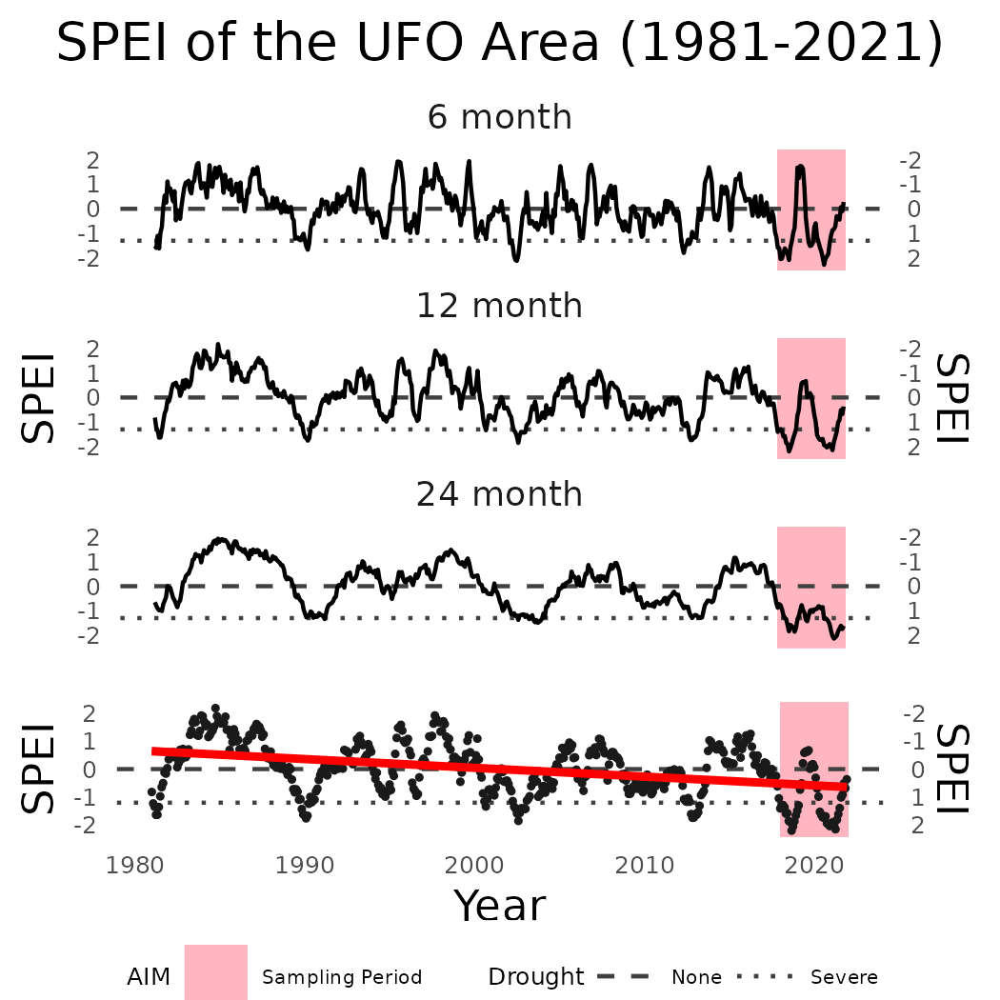

## Background 
The AIM sample design is split into five panels, one for each year, with the intention that temporal analyses can be conducted across the panels (*see X.X for more info*). Ideally, these panels will reflect consistent natural climatic variation. In others words, some years will be drier while other years will be wetter. However, we felt, and our constant monitoring of the University of Nebraska-Lincolns Drought Monitor over this period, supported the notion that we sampled during a period of immense drought. Here we contextualize our sampling period within the known climatic variation in the field office, and discuss why we dismiss calculating AIM metrics separately for each year. 

Contrary to the concept of Agricultural drought, the exploration and understanding of Ecological drought is nascent and not as well defined (@crausbay2017defining, @slette2019ecologists). In fact, numerous recent papers published in *peer-reviewed journals* have sought to both define this term, and formulate it in a way which it may be applied to the management of natural resources. A recent example of the term is:

> "_**ecological drought** ... an episodic deficit in water availability that drives ecosystems beyond thresholds of vulnerability, impacts ecosystem services, and triggers feedbacks in natural and/or human systems_" 
>
> `r tufte::quote_footer('--- Crausbay et al. 2017')`

Guidance regarding how to move from defining the term 'ecological drought' to using it this term is also recent, and limited.

> "_We suggest that future drought publications provide at least one of the following: 
**(a)** the climatic context of the drought period based on long‐term records; **(b)** standardized climatic index values; **(c)** published metrics from drought‐monitoring organizations; **(d)** a quantitative definition of what the authors consider to be drought conditions for their system_"
>  
> `r tufte::quote_footer('--- Slette et al. 2019')`

In this section, we perform both operations **a, b**, and calculate our own drought metrics using the exact same equations, and software implementations to calculate **c**, as these organizations. We opt to calculate **c** ourselves due to the topographic complexity (rugged mountainous) of the study area making the coarse scale models generated by other organizations of limited utility in understanding the Uncompahgre Field Office. Finally, for the purposes of this document we do define **d** for our field office, using the expertise of several Natural Resource Specialists in Western Colorado. Hence, in this section we will meet not only the suggested one metric above, but all of them. 

```{r setup, include=FALSE}
knitr::opts_chunk$set(echo = F)
knitr::opts_chunk$set(dpi = 300) 
knitr::opts_chunk$set(message = F)
knitr::opts_chunk$set(warning = F)

```

```{r load libraries, warning=F, message = F}
library(tidyverse)
library(terra)
source('functions.R')
```

## Methods: 

The two major calculations of drought metrics are essentially contingent upon the amount of moisture entering an area, and the amount of moisture leaving that area. The amount of moisture entering an area, is simply equivalent to the volume or precipitation, in any form (e.g. rain or snow). The amount of moisture leaving via the process of evaporation is driven by many processes, such as the amount and intensity of sunshine, wind, temperature. The amounts of potential evaporation (the evaporation which would occur is sufficient amounts of water were present to allow) is commonly modelled using one of three models, which since their original developments have been slightly modified in numerous ways. In order of increasing complexity these are the Thornwaite, Hargreaves, and the Penman-Montieth equations (@thornthwaite1948approach @penman1948natural, @hargreaves1985irrigation). We chose to utilize the Penman-Montieth equation to estimate the Potential Evaporation in our study area, because both the Thornwaite and Hargreaves equations have been shown to under-estimate drought conditions in arid regions (@begueria2014standardized). 

Their @vicente2010multiscalar, @begueria2014standardized

```{r Create template raster for sun hours, eval = F}

template <- rast('/hdd/Geospatial_data/sunhours/input/UFO_dem_10_smooth.tif')
xy <- ext(template)

coarse_template <- rast(nrow = 100, ncol = 100, crs = crs(template),
     xmin = xy[1], xmax =	 xy[2], ymin 	=  xy[3], ymax =  xy[4], vals = 0
       )
writeRaster(coarse_template, '/hdd/Geospatial_data/sunhours/input/coarse.tif')

rm(template, xy, coarse_template)
```

```{bash calculate sun hours in GRASS GIS, eval = F}
grass --tmp-location /hdd/Geospatial_data/sunhours/input/coarse.tif
pOUT='/hdd/Geospatial_data/sunhours/output'

for i in {1..365}
do
  rasterfari=SunHours$i
  r.sunhours sunhour=$rasterfari year=2000 day=$i --overwrite
  r.out.gdal input=$rasterfari output=$pOUT/${rasterfari} format=GTiff -c --overwrite
done

r.in.gdal input=/hdd/Geospatial_data/sunhours/input/coarse.tif output=coarseDEM

for i in {1..365}
do
  rasterfari=BeamRad$i
  r.sun beam_rad=$rasterfari day=$i --overwrite nprocs=16 elevation=coarseDEM linke_value=2.325
  r.out.gdal input=$rasterfari output=$pOUT/${rasterfari} format=GTiff -c --overwrite
done

exit

```

Metrics of sunshine were calculated using r.sun (total beam irradiance) and r.sunhours (daily sunhours) in Grass GIS (@GRASS_GIS_software), on Linux Ubuntu 20.04.5 LTS. The function r.sunhours requires a year for which to calculate these values for, the year 2000 was selected as it represents a rounded midpoint of the temporal range of the climate variables (1979-2021), the linke value for r.sun was set at 2.35 (in lieu of the default value of 3.0), which is the mean of the annual linke value for mountains (2.75), and rural areas (1.9). Subsequent to these calculations, which were performed for each day of the year, the values were recalculated as monthly means. Subsequent to the calculations the total sun hours were subtracted from the mean monthly percent cloud cover dataset. 

```{r Process Sun Hour Data into Monthly Means, eval =F}

sh_p <- '/hdd/Geospatial_data/sunhours/output'

files <- data.frame(filename = list.files(sh_p, pattern = 'SunHours')) %>% 
  mutate(number = as.numeric(str_extract_all(filename,"\\(?[0-9,.]+\\)?")),
         fpath = file.path(sh_p, filename)) %>% 
  arrange(number) %>% 
  bind_cols(., 'Month' =  dmonths_normal)

mean_rasters <- files %>% 
  split(., .$Month) %>% 
  lapply(., '[[', c('fpath')) %>% 
  map(., rast) %>% 
  map(., mean)
mean_rasters <- rast(mean_rasters)

writeRaster(mean_rasters, '../data/raw/MeanSunHours.tif', overwrite = T)
file.remove(files$fpath)

# repeat the process for solar radiation. 
files <- data.frame(filename = list.files(sh_p, pattern = 'BeamRad')) %>% 
  mutate(number = as.numeric(str_extract_all(filename,"\\(?[0-9,.]+\\)?")),
         fpath = file.path(sh_p, filename)) %>% 
  arrange(number) %>% 
  bind_cols(., 'Month' =  dmonths_normal)

mean_rasters <- files %>% 
  split(., .$Month) %>% 
  lapply(., '[[', c('fpath')) %>% 
  map(., rast) %>% 
  map(., mean)
mean_rasters <- rast(mean_rasters)
mean_rasters <- mean_rasters * 0.0036 # conversion to MegaJoules, you can 
# compare your values to a kilowatt / hour map to see if you are in the range
# before you do this just do mean( mean_raster/1000 ) and is is really
# quick to find an annual map, I recommend doing it to make sure your calcs worked
# out A-OK - this stuff is way outside my wheelhouse. Ours are spot on. 

writeRaster(mean_rasters, '../data/raw/MeanRadiation.tif', overwrite = T)
file.remove(files$fpath)

rm(pancake, dmonths, sh_p, files, mean_rasters)
```

```{r Download climate vars from gridmet and subset, eval = F}

p <- '/media/reed/ExternalHD/drought_geospatial/Gridmet'
Get_Gridmet(product_type = "pr", start_year = 1979, end_year = 2021, destination = p)
Get_Gridmet(product_type = "tmmx", start_year = 1979, end_year = 2021, destination = p)
Get_Gridmet(product_type = "tmmn", start_year = 1979, end_year = 2021, destination = p)
Get_Gridmet(product_type = "vs", start_year = 1979, end_year = 2021, destination = p)
Get_Gridmet(product_type = "rmax", start_year = 1979, end_year = 2021, destination = p)
Get_Gridmet(product_type = "rmin", start_year = 1979, end_year = 2021, destination = p)
p <- file.path(p, 'Gridmet')

```


All climate variables, aside from cloud cover, were downloaded from gridMet using 'Get_Gridmet' (@abatzoglou2013development, Lovell & Benkendorf 2022). These variables were chosen in lieu of one of the two datasets from which they are derived, PRISM, due to that dataset lacking Wind Speed and Relative Humidity data (@abatzoglou2013development). As gridMET data are at a daily resolution, the means for each month of each year from 1979 to 2021 were calculated using R. The temperature values were converted to Celsius from Kelvin $x - 273.5$. 

```{r reduce gridmet climate vars to monthly means, eval = F}
# now reduce the size of these data by making the monthly means
root_p <- '/media/reed/ExternalHD/drought_geospatial/Gridmet'
out_p <- '/media/reed/ExternalHD/drought_geospatial/monthly_gridmet'
crop_p <- '../data/raw/UFO_slope_deg.tif'

gridSTATS(inpath = root_p , FUN = mean,  outpath = out_p, cropRast = crop_p, variable = 'vs')
gridSTATSsum(inpath = root_p , outpath = out_p, cropRast = crop_p, variable = 'pr')
gridSTATS(inpath = root_p , FUN = mean,  outpath = out_p, cropRast = crop_p, variable = 'tmmn')
gridSTATS(inpath = root_p , FUN = mean,  outpath = out_p, cropRast = crop_p, variable = 'tmmx')
gridSTATS(inpath = root_p , FUN = mean,  outpath = out_p, cropRast = crop_p, variable = 'rmax')
gridSTATS(inpath = root_p , FUN = mean,  outpath = out_p, cropRast = crop_p, variable = 'rmin')

rmax <- rast(file.path(out_p, 'rmin', (list.files(file.path(out_p, 'rmin')))))
rmin <- rast(file.path(out_p, 'rmax', (list.files(file.path(out_p, 'rmax')))))
rhmean <- mean(rmax, rmin)
rhmean <- split(rhmean, leapYearLookUp$Year)
names(rhmean) <- unique(leapYearLookUp$Year)

ifelse(!dir.exists(file.path(out_p, 'rhmean')), 
         dir.create(file.path(out_p, 'rhmean')), FALSE)
fnames <- file.path(out_p, 'rhmean', paste0('rhmean', '_', names(rhmean), '.tif'))
mapply(writeRaster, rhmean, fnames, overwrite =T)

rm(root_p, out_p, crop_p, gridSTATS)
```

```{r Border, eval= F}
border <- ext(rast('../data/raw/UFO_slope_deg.tif'))
```

Cloud Cover data were downloaded from EarthENV, from the study of Wilson (2016), and were transformed back into percentages by multiplying $x * 0.01$, raster data are often transmitted with alterations of decimal points to reduce the file size. 

```{r Crop Cloud data, eval = F}

cpath <- '/media/reed/ExternalHD/drought_geospatial/cloud'
cfiles <- file.path(cpath, list.files(cpath, pattern = "tif$"))
clouds <- rast(cfiles)

border <- project(rast('../data/raw/UFO_slope_deg.tif'), crs(clouds))
clouds <- crop(clouds, border)
template <- rast('/media/reed/ExternalHD/drought_geospatial/monthly_gridmet/vs/vs_1979.tif')[[1]]
clouds <- aggregate(clouds, fact =4)
clouds <- resample(clouds, template, method  = 'cubic')
names(clouds) <- unique(dmonths_normal)

# 0.01 the clouds values range from 0-10,000, and need be multiplied by 0.01 to recover % cover
clouds <- clouds * 0.01
plot(clouds)

writeRaster(clouds, '../data/raw/clouds.tif', NAflag=NA, overwrite = T)
rm(cpath, clouds, border, cfiles)
```


```{r subtract clouds from sun hours, eval = F}
SunHours <- rast('/media/reed/ExternalHD/UFO_drought/data/raw/MeanSunHours.tif')
SunHours <- resample(SunHours, template, method  = 'cubic')
SunHours <- SunHours[[unique(dmonths_normal)]]
SunHours <- project(SunHours, crs(template))

cloud_rasters <- 1 - (rast('../data/raw/clouds.tif') * 0.01 )  # to get a leading zero for a proportion
SunHours <- SunHours * cloud_rasters

writeRaster(SunHours, '../data/raw/MeanSunHours.tif',
            overwrite = T)
rm(SunHours)
```

```{r Process and match extent for total solar radiation, eval = F}
solar_radiation <- rast('../data/raw/MeanRadiation.tif')
solar_radiation <- resample(solar_radiation, template, method  = 'cubic')
solar_radiation <- solar_radiation[[unique(dmonths_normal)]]
solar_radiation <- project(solar_radiation, crs(template))

writeRaster(solar_radiation, '../data/raw/MeanSolarRadiation.tif',
            overwrite = T)
rm(solar_radiation)
```

The digital elevation model (DEM), which was utilized in the calculation of sunshine metrics and in the Penman equation, was downloaded from EarthENV, and re-sampled from it's native 90m resolution to align with the grain of the other datasets - 4km (@robinson2014earthenv).

```{r Crop DEM, eval = F}

dpath <- '/media/reed/ExternalHD/drought_geospatial/dem'
dem <- rast(file.path(dpath, list.files(dpath, pattern = "bil$", recursive = T)))

border <- project(rast('../data/raw/UFO_slope_deg.tif'), crs(dem))
dem <- crop(dem, border)

template <- rast('/media/reed/ExternalHD/drought_geospatial/monthly_gridmet/vs/vs_1979.tif')[[1]]
dem <- resample(dem, template, method  = 'cubic')
dem <- exactextractr::exact_resample(dem, template, "mean")

writeRaster(dem, '../data/raw/dem.tif', overwrite = T)
rm(dpath, dem, template)
```


__Variables to calculate Potential Evaporation via the Penman-Montieth equation__

|            Variable            |           Source            |
|  :------------------------:    |     :---------------:       |
|    precipitation sum (mm)      |       GridMET  (pr)         |
|      mean max temp (ºC)        |       GridMET (tmmx)        |
|      mean min temp (ºC)        |       GridMET (tmmn)        |
|      mean rel. humidity        | $(RH_{max} + RH_{min}) /2$  |
|    mean wind speed (km h-1)    |       GridMET (vs)          |        
|     mean sun hours (hours)     |     r.sunhours (sunhour)    |
|  mean solar radiation (MJ-m-d) |       r.sun (beam_rad)      |
|   mean cloud cover (percent)   |     Wilson, EarthEnv        |
|     elevation in meters        |       EarthEnv 90m          |

Note all of these values are over a month 

```{r SPEI vars}
myscales <- c(6,12,24)
syear <- 1979
eyear <- 2021
focal_window <- 9
```

```{r Calculate SPEI, eval = F}
out_p <- '/media/reed/ExternalHD/drought_geospatial/monthly_gridmet'
template <- rast('/media/reed/ExternalHD/drought_geospatial/monthly_gridmet/vs/vs_1979.tif')[[1]]

cloudCover <- rast('../data/raw/clouds.tif')
sunHours <- rast('../data/raw/MeanSunHours.tif')
dem <- rast('../data/raw/dem.tif')
solarRadiation <- rast('../data/raw/MeanSolarRadiation.tif')

vs <- rast(file.path(out_p, 'vs', (list.files(file.path(out_p, 'vs')))))
tmax <- rast(file.path(out_p, 'tmmx', (list.files(file.path(out_p, 'tmmx')))))
tmin <- rast(file.path(out_p, 'tmmn', (list.files(file.path(out_p, 'tmmn')))))
pr <- rast(file.path(out_p, 'pr', (list.files(file.path(out_p, 'pr'))))) # rhmean.tif
rh <- rast(file.path(out_p, 'rhmean', (list.files(file.path(out_p, 'rhmean')))))

names(vs) <- namer(vs, start = syear, end = eyear)
names(tmax) <- namer(tmax, start = syear)
names(tmin) <- namer(tmin, start = syear)
names(pr) <- namer(pr, start = syear)
names(rh) <- namer(rh, start = syear)
names(dem) <- 'elevation'
variables <- c(vs, tmax, tmin, rh, pr, dem)

names(cloudCover) <- paste0('cloudcover_', unique(dmonths_normal))
names(sunHours) <- paste0('sunhours_', names(sunHours))
names(solarRadiation) <- paste0('radiation_', names(solarRadiation))
suncloud <- c(cloudCover, sunHours, solarRadiation)

cloudvals <- as.data.frame(suncloud) %>% 
  rownames_to_column('CellID') %>% 
  pivot_longer(!CellID, names_to = 'combo', values_to = 'value') %>% 
  separate(combo, c('variable', 'month')) %>% 
  pivot_wider(names_from = variable, values_from = value)
drought_vars <- as.data.frame(variables, xy = T) %>% 
  rownames_to_column('CellID') %>% 
  pivot_longer(4:(ncol(.)-1)) %>% 
  separate(name, c('variable', 'month', 'year')) %>% 
  pivot_wider( names_from = variable, values_from = value) %>% 
  left_join(., cloudvals) %>% 
  mutate(across(.cols = tmax:tmin, ~.x - 273.5 ))

rm(cloudvals, suncloud, vs, tmax, tmin, variables, dem, pr, sunHours, rh, 
   solarRadiation, cloud_rasters)

# drought_vars <- drought_vars[complete.cases(drought_vars),]
out <- drought_vars %>% 
  rowwise() %>% 
  split(., .$CellID) %>% 
  map(~ PeTbyCell(x = .x)) %>% 
  bind_rows() %>% 
  arrange(CellID, year) %>% 
  split(., .$CellID) %>% 
  map(~ SPEIbyCell(x = .x, start_yr = syear, id_var = 'CellID', scales = myscales)) %>% 
  bind_rows()

# now we will split these out so that each year x calculation duration has a stack. 
resin <- out %>% 
  pivot_longer(cols = starts_with('months'), names_to = 'period', values_to = 'SPEI') %>% 
  split(., .[,c('period','Year', 'Month')]) %>% 
  map(~ rast(template, vals = .x$SPEI))

vars <- c('months_6', 'months_12', 'months_24')
times <- leapYearLookUp %>% 
  mutate(time = paste0(Year, '.', MONTH)) %>% 
  pull(time)
vars2 <- paste0(rep(vars, each =  length(times)), '.', times)
names(resin) <- vars2
splits <- data.frame(raw = vars2) %>% 
  separate(raw, into = c('period', 'year', 'month'), sep = '[.]')

resin <- resin[vars2]
resin <- split(resin, splits$period)
resin <- lapply(resin, rast)

resin <- lapply(resin, focal, w = focal_window, na.policy="only",  na.rm=TRUE, fun = mean)

outpath <- '../data/processed'
variable <- 'SPEI'
ifelse(!dir.exists(file.path(outpath)), 
       dir.create(file.path(outpath)), FALSE)
ifelse(!dir.exists(file.path(outpath, variable)), 
       dir.create(file.path(outpath, variable)), FALSE)
fnames <- file.path(outpath, variable, paste0(variable, '_', names(resin), '.tif'))
mapply(writeRaster, resin, fnames, overwrite = T)

rm(tmax, tmin, vs, variables, cloudCover, cloudvals, dem, sunHours, suncloud, 
   SunHours, pr, out_p, outpath, variable, resin , splits, vars2, vars, out, 
   fnames, times, drought_vars)
```

SPEI was calculated for all `r toString(eyear-syear)` years between `r toString(syear)`-`r toString(eyear)`. Cells in rasters which contained missing (NA) values, these resulting from missing a value required for either the penman or SPEI calculations, were filled using the 'focal' function from the r package 'Terra'. This function calculated the mean of the `r toString(focal_window)` nearest pixels to the missing value. SPEI was calculated using moisture balances of the: `r toString(myscales)` months preceding the current month of analysis. For example, the SPEI value for the Month of January 1981, under a scenario with a 6 month window, would go back as far as June 1980, while for a longer window such as 24 months, would go back to January 1979. Because our SPEI calculations included these windows, each data set could not-natively start at the same date. For example our dataset with the longest SPEI window, `r toString(max(myscales))` months, exceeded the shortest windows by `r toString(max(myscales) - min(myscales))`. Accordingly, we removed any months of values preceding the origin date for the start of the longest SPEI calculation intervals, and for ease of analysis and reporting began our background climate dataset in `r toString(syear + max(myscales)/12)`.

```{r}
rm(leapYearLookUp, dmonths_leap, dmonths_normal, fchoice, gridSTATSsum, 
   namer, PeTbyCell, SPEIbyCell)
rm(syear, eyear, focal_window, myscales)
```

We subset the drought data so that the beginning period for all temporal extents has the same start date, January 1981. It is recommended to have 30 years of climate data to compare local conditions to. We will span the years from 1981-2015 as our `r 2015-1981` year background data. This will also allow a slight degree of buffering between our data sets, so that the starting times between our two datasets, the occurrence of drought during the AIM sampling, and the historic climate variables are not temporally replicated. 

        SPI Values Interpretation
|     Value       |    Interpretation       |
| :------------:  | :------------------:    |
|     > -0.5      |      near normal        | 
|  -0.5 to -0.7   |    Abnormally Dry       |
|  -0.8 to -1.2   |   Moderate Drought      |
|  -1.3 to -1.5   |    Severe Drought       |
|  -1.6 to -1.9   |    Extreme Drought      |
|    < -2.0       |  Exceptional Drought    |

From a presentation by Brian Fuchs of the National Drought Mitigation Center and University of Nebraska-Lincoln

```{r Line Plots SPEI of UFO area, eval = F}
fp <- '../data/processed/SPEI'

v6  <- drought_prep(path = fp, start_layer = 25, set =  '6')
v12 <- drought_prep(path = fp, start_layer = 25, set = '12')
v24 <- drought_prep(path = fp, start_layer = 25, set = '24')

drought_mean_vals <- bind_rows(v6, v12, v24) %>% 
  mutate(period = factor(period, levels = c('months_6', 'months_12', 'months_24')))
  
p1 <- ggplot(drought_mean_vals, aes(x = Date, y = SPEI)) +
  
  geom_rect(aes(xmin = 2018, xmax = 2022, ymin = -Inf, ymax = Inf, fill = "Sampling Period"), color = 'NA') +
  geom_hline(aes(yintercept = 0, linetype = 'None'),  colour = 'grey25') +
  geom_hline(aes(yintercept = -1.2, linetype = "Severe"), colour = 'grey25') +
  scale_linetype_manual(name = "Drought", values = c(2, 3), 
                    guide = guide_legend(override.aes = list(color = c("grey25", "grey25")))) +
  scale_fill_manual('AIM', values = 'lightpink',  
                      guide = guide_legend(override.aes = list(alpha = 1))) +
  geom_line() +
  facet_wrap('period', ncol = 1,   
             labeller = labeller(period = 
                                   c("months_6" = "6 month",
                                     "months_12" = "12 month",
                                     "months_24" = "24 month"))) +
  theme_classic() +
  labs(title = "SPEI of the UFO Area (1981-2021)",
    x = NULL, y = "SPEI") +
  theme(plot.title = element_text(hjust = 0.5, 1.2), 
        strip.background = element_blank(),
        axis.ticks = element_blank(),
        axis.line = element_blank(),
        axis.text.x = element_blank(),
        legend.title.align = 0.5,
        panel.spacing = unit(0,'lines')) +
  scale_y_continuous(sec.axis = dup_axis(labels = c(' 2', ' 1', ' 0', '-1', '-2')), name = "SPEI") +
  scale_x_continuous(breaks = c(seq(from = 1980, to = 2020, by = 5))) +
  
  theme(legend.position = "none")


p2 <- drought_mean_vals %>% 
  filter(period == 'months_12') %>% 
  ggplot(., aes(x = Date, y = SPEI)) +
  
  geom_rect(aes(xmin = 2018, xmax = 2022, ymin = -Inf, ymax = Inf, fill = "Sampling Period"), color = 'NA') +
  geom_hline(aes(yintercept = 0, linetype = 'Normal'),  colour = 'grey25') +
  geom_hline(aes(yintercept = -1.2, linetype = "Severe"), colour = 'grey25') +
  
  geom_point(color = 'grey10', pch = 16, cex = 0.7) +
  geom_smooth(method = 'loess', colour = 'red', formula = 'y ~ x', fill = 'grey15' ) +
  scale_linetype_manual(name = "Indicator", values = c(2, 3), 
                    guide = guide_legend(override.aes = list(color = c("grey25", "grey25")))) +
  scale_fill_manual('AIM', values = 'lightpink',  
                    guide = guide_legend(override.aes = list(alpha = 1))) +

  scale_y_continuous( sec.axis = dup_axis(labels = c(' 2', ' 1', ' 0', '-1', '-2')), name = "SPEI") +
  scale_x_continuous(breaks = c(seq(from = 1980, to = 2020, by = 5))) +
  theme_classic() +
  theme(legend.position="none",
        plot.title = element_text(hjust = 0.5, 1.2), 
        strip.background = element_blank(),
        axis.ticks = element_blank(),
        axis.line = element_blank(),
        legend.title = element_blank(),
        legend.title.align = 0.5) +
  labs(title = "", x = "Year", y = "")

combined_plot <- cowplot::plot_grid(p1, p2,ncol=1, rel_heights = c(1, 0.4))

legend <- cowplot::get_legend( p1 +
                                 guides(color = guide_legend(nrow = 1)) +
                                 theme(legend.position = "bottom") )

p <- cowplot::plot_grid(combined_plot, legend,ncol=1,rel_heights = c(1, .1), rel_widths = c(1, .25))

ggsave('SPEI_UFO_AREA.png', plot = p, device = 'png', path = '../results' ,
       scale = 1, width = 5, height = 5, dpi = 300, 
       units = "in")

```




# References
